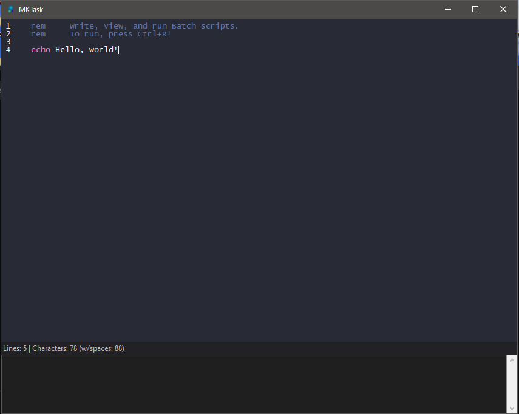

# MkTask
 
MkTask (short for MakeTask) is a lightweight code editor for Batch. Execute scripts on the go, with syntax highlighting
and auto indentation. Make scripts run on startup with our tasking features!

Built with Tkinter

# Manual

Once you've loaded MkTask, you will see two sections - the *Coding* section and the *Output* section. The output section
is not really used.

**Context menu**

To enter, right click on the coding section. Upon clicking, you will be greeted with all of our commands. Which include:
* **Run file (CTRL+R)** Runs script
* **Run here (ALT-R)** Runs script inside MkTask(Not recommended - may crash)
* **Open file (CTRL+O)** Open a file and edit, run, and view its content
* **Open script location (CTRL+F)** Opens the directory in which the default code is stored.
* **Add to startup (CTRL+M)** Adds current script to startup
* **View startup tasks (ALT+T)** Shows all startups tasks

Misc

* **Copy all (CTRL+X)**
* **Clear all (CTRL+B)**

*Note*: MkTask is a quick Batch editor and executor, and should not be used as a full on IDE. Almost ALL of the commands you'll ever use are Run, Make Task, and Open File.
*Another note* MkTask automatically adds `@echo off` at the start of every script (not shown in the editor), and `pause` at the end.

**Custom commands**
We've implemented some custom Batch commands (place these commands anywhere inside your script **Must be compiled with MKTask**):
* noauto (Disables auto echo off and auto pause at the end)
* error  (Prints theres been an error)

# Notes
Right now, features like making projects, undo & redo, **are** developed, but disabled due to tons of bugs (Which I will be fixing). So for now, theres no undo and redo or projects.

MkTask is made using Python 3.11, and compiled with PyInstaller. That means this program is heavy and slow, which sadly means all I can do is just add optimizations. **Feel free to help out and discuss!**

Another note: If you decide to compile MkTask by yourself, make sure to remove unused libraries from the `_internal` folder in the PyInstaller output. Libraries scuh as:
* PIL
* Qt5
* PySide6
* SetupTools

ALSO! Make sure to drag in the `chlorophyll` folder inside that `_internal` folder or else the program won't start!
